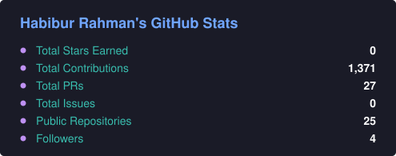
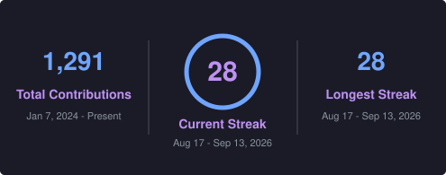
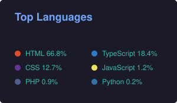

<!-- Banner -->

<h1 align="center">Habibur Rahman (Habib) 👋</h1>
<h3 align="center">Full-Stack JavaScript Developer &nbsp;|&nbsp; WordPress/Elementor Specialist &nbsp;|&nbsp; Healthcare Web Niche</h3>

  
  
  
  
  

---

### 👨‍💻 About Me

I'm a full-stack JavaScript developer with two focus areas that reinforce each other:

- 🧠 **Full-Stack Development** — React, Next.js, Node.js, TypeScript, MongoDB (MERN)
- 🏥 **WordPress/Elementor Specialist** — building and optimizing healthcare & medical clinic websites (performance, SEO, ACF, custom integrations)

Currently working remotely as a full-stack developer at **Spiel Creative** (UK-based digital agency), building and maintaining WordPress and Next.js sites for healthcare clients — alongside active freelancing on **Upwork** (Top Rated, 100% JSS) and **Fiverr**.

- 💼 Portfolio: [habibur-rahman-amber.vercel.app](https://habibur-rahman-amber.vercel.app/)
- 🛠 Currently building: WordPress-to-Next.js migration pilots for existing client sites
- 📈 Learning: Framer Motion, advanced UX, modern web animation
- 📫 Contact: [habiburwebx@gmail.com](mailto:habiburwebx@gmail.com)

---

### 💼 Featured Work

#### 🏥 Healthcare & Medical Clinic Websites (WordPress/Elementor)
Built and maintained for UK-based clinics — performance tuning, custom ACF-driven pages, SEO fixes, and infrastructure troubleshooting (migrations, malware cleanup, database optimization).

| Project | Stack |
|---|---|
| [London Cataract Centre](https://londoncataractcentre.co.uk/) | Elementor, HFE, CF7, Owl Carousel |
| [Professor PS](https://demo.professorps.co.uk/) | WordPress, custom fonts (Typekit) |
| [BPPEP](https://bppep.co.uk/) | WordPress/Elementor |
| [DRP Research](https://drpresearch.co.uk/) | WordPress/Elementor |
| [LMA Clinic](https://lmaclinic.com/) | WordPress/Elementor |
| [Tucki AI](https://tucki.ai/) | Divi |

#### 🔁 WordPress Migration
- [Loan Persona](https://loanpersona.com/) — Full WordPress migration (Upwork client project)
- [Channel Do News](https://channeldonews.com/) — News portal

#### ⚛️ Full-Stack (MERN / Next.js) Projects
| Project | Description |
|---|---|
| [Gadgets Hub](https://gadgets-hub-topaz.vercel.app/) | E-commerce store — MERN + Redux Toolkit, admin panel, advanced filtering |
| [MediNest](https://medinest-client.vercel.app/) | Medicine e-commerce — Next.js, Redux Toolkit, Firebase Auth, Shadcn/UI |
| [One Face Kit](https://onefacekit.com/) | Full-stack web app |
| [Nicholas Realty](https://nrprobate.com/) | Real estate site for a California probate realtor — local SEO focus |
| [Life Finder](https://life-finder.com/) | Full-stack backend project |

> 🔗 More in my [GitHub pinned repositories](https://github.com/shakibwebx?tab=repositories).

---

### 🧰 Tech Stack & Tools

**Languages & Frameworks**

  

**Design, Testing & Deployment**

  

---

### 📈 GitHub Stats

<!-- Cards are snapshotted daily into assets/ by .github/workflows/refresh-stats.yml,
     so they keep rendering even when the public github-readme-stats instance is rate limited. -->

  
   
  
   
  

---

### 🤝 Let's Connect

Open to:
- 🏥 WordPress/Elementor projects, especially healthcare & clinic sites
- ⚛️ Full-stack MERN / Next.js builds and dashboards
- 🌐 Freelance work via Upwork or Fiverr
- 🎯 Open-source or startup collaborations

📬 **Reach out:** [hello@skbshakib.com](mailto:hello@skbshakib.com)

---

> *"Great products start with great code — clean, purposeful, and built for the client's actual problem."*
> 
